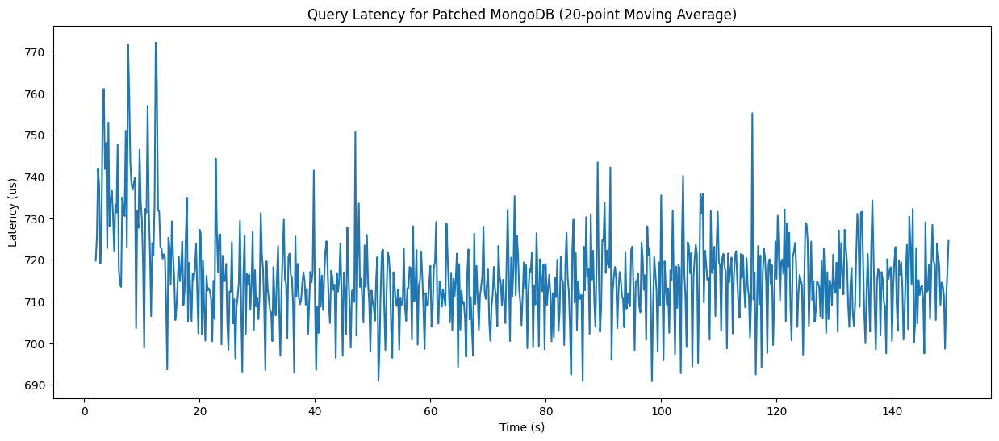
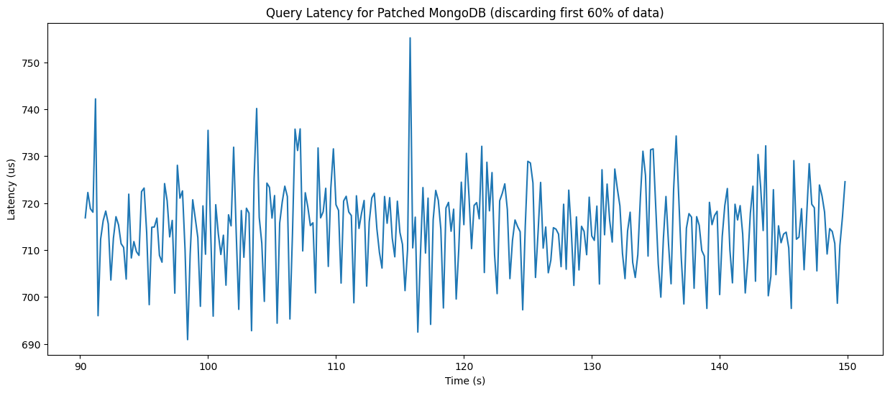
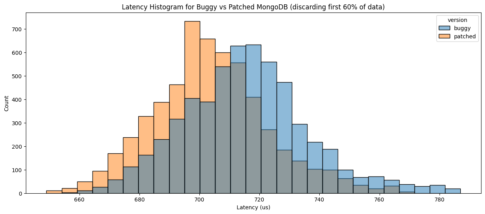

# Tutorial: investigating a tiny performance regression with [`pt-fuser`](https://github.com/ethan-vanderheijden/pt-fuser)

This interactive tutorial will walk you through setting up your testing environment and investigating a real-world bug in MongoDB v7.0.0 with the help of our tool, [`pt-fuser`](https://github.com/ethan-vanderheijden/pt-fuser). You are encouraged to run all these commands on your own machine, and if you encounter any issues, please open an issue or a pull request!

### Table of Contents

<ol>
    <li><a href="#building-mongodb-v700">Building MongoDB v7.0.0</a></li>
    <li><a href="#setting-up-ycsb-mongodb">Setting up YCSB / MongoDB</a></li>
    <li><a href="#setting-up-your-testing-environment">Setting up your testing environment</a></li>
    <li>
        <a href="#traditional-performance-analysis">Traditional Performance Analysis</a>
        <ul>
        <li><a href="#benchmark-metrics">Benchmark metrics</a></li>
        <li><a href="#flamegraphs">Flamegraphs</a></li>
        <li><a href="#function-latency-instrumentation">Function latency instrumentation</a></li>
        </ul>
    </li>
    <li>
        <a href="#pt-fuser-workflow">pt-fuser Workflow</a>
        <ul>
        <li><a href="#collecting-filtering-and-merging-traces">Collecting, filtering, and merging traces</a></li>
        <li><a href="#visualizing-and-comparing-traces">Visualizing traces and performing a manual comparison</a></li>
        </ul>
    </li>
    <li><a href="#takeaways">Takeaways</a></li>
</ol>

## Building MongoDB v7.0.0

In this tutorial, we will investigate a real performance regression that affected MongoDB versions 4.7.0 through 7.1.0. We will build MongoDB v7.0.0 from source, which contains the regression, and then rebuild it after applying the fix. In the following sections, we will analyze the performance of both versions to see how we may detect such a tiny regression.

For reference, the regression was introduced in [this commit](https://github.com/mongodb/mongo/commit/eaaee39e2c4eaf9938c5a75bce30648435ae10cc#diff-7b9a463114d0718dd549d5a65df54e34c431f389cb7f579bc7e4bc9560bf2099). The regression was filed in [this JIRA ticket](https://jira.mongodb.org/browse/SERVER-79775), and it was ultimately fixed by [this commit](https://github.com/mongodb/mongo/commit/6a82e4262717c24bd088141369921a5ae0ec2d82).

### What was the regression?

The regression was located in the function `parseSubFields()` inside ***mongo/src/mongo/db/matcher/expression_parser.cpp***. This function is part of the query parsing code, so it is executed at the beginning of every query.

In the code, it calls `e.wrap()`, where `e` is a `BSONElement` object, which the `BSONElement` object to be copied:
```cpp
doc_validation_error::createAnnotation(
    expCtx,
    e.fieldNameStringData().toString(),
    BSON(name << e.wrap())
)
```

However, `createAnnotation()` was actually a no-op because the guard is false and the functions just returns `NULL`:
```cpp
createAnnotation() {
  if (expCtx->isParsingCollectionValidator) {  // this guard is false
    ...
  } else {
    return NULL;
  }
}
```

The fix is to check the guard `if (expCtx->isParsingCollectionValidator)` before calling `e.wrap()`, skipping the extraneous object copy.

### Building MongoDB

Generally speaking, for performance testing, you need to build the binaries from source rather than download pre-built binaries from a package manager. Each software project uses a different build system, so you'll need to consult their documentation. Word of warning: figuring out a new build system can be quite time-consuming, especially if you are building an old version of the codebase because modern compilers can throw all sorts of weird errors when compiling old code.

MongoDB's documentation can be found in [mongo/docs/building.md](https://github.com/mongodb/mongo/blob/r7.0.0/docs/building.md). All MongoDB versions have a corresponding git tag, so in particular, the tag "r7.0.0" corresponds to MongoDB v7.0.0.

To begin, let's create a directory for all our work and clone the MongoDB repository:
```bash
mkdir creep-tutorial
cd creep-tutorial

# for future reference, let's record the tutorial directory
export TUTORIAL_DIR=$(pwd)

# clone with depth of 1 to discard all git history, which speeds up the cloning process
git clone --branch r7.0.0 --depth 1 https://github.com/mongodb/mongo.git
```

MongoDB's build system uses Python, so let's create a virtual environment and install all the necessary dependencies.

However, we must use a version of Python <3.12 because MongoDB v7.0.0 uses an old version of `setuptools` that relies on a feature removed in Python 3.12. In the following command, I will use Python 3.11.

Also, we must edit `mongo/etc/pip/components/core.req` and change the line `PyYAML >= 3.0.0, <= 6.0.3` to `PyYAML >= 3.0.0`. Otherwise, it will try to install PyYAML v6.0.0, which is a broken release. Building old code is so much fun, isn't it? Now, we can continue:

```bash
python3.11 -m venv venv-3-11
source venv-3-11/bin/activate

python3 -m pip install -r mongo/etc/pip/compile-requirements.txt
```

Next, we have to monkey patch the source code to ensure it compiles without errors:
- Open `src/third_party/boost/boost/thread/future.hpp`, go to line 4672, and change `that_=x.that;` to `that_=x.that_;`. Believe it or not, this is a [known typo](https://github.com/boostorg/thread/issues/402) in older versions of the Boost library.
- Open `src/mongo/db/free_mon/free_mon_options.h` and add `#include <cstdint>` at the top of the file. Otherwise, the compiler will throw bespoke errors when it tries to compile `enum class EnableCloudStateEnum : std::int32_t` because `std::int32_t` is undefined.

Finally, let's create a directory to store the final MongoDB binary. We will be building MongoDB twice, once for the buggy version and once for the patched version:
```bash
mkdir install-mongo-buggy
mkdir install-mongo-patched
```

Now, we can build the original, buggy version of MongoDB v7.0.0:
```bash
cd mongo

# Modern compilers are stricter and throw more warnings than old compilers
# we need --disable-warnings-as-errors to ignore these recently introduced warnings
python3 buildscripts/scons.py \
   DESTDIR=../install-mongo-buggy/ \
   install-mongod \
   --disable-warnings-as-errors
```

> [!WARNING]  
> Building MongoDB for the first time can take up to an hour!

Next, we will apply the git patch fixing the regression and rebuild MongoDB. You can download the patch ([resources/mongo-regression.patch](resources/mongo-regression.patch)) from this repository.
```bash
git apply ../mongo-regression.patch

python3 buildscripts/scons.py \
   DESTDIR=../install-mongo-patched/ \
   install-mongod \
   --disable-warnings-as-errors
```

## Setting up YCSB / MongoDB

Now that we have our database built, we need a benchmarking tool to run queries against the database and measure its performance. We will be using [go-ycsb](https://github.com/pingcap/go-ycsb), a fork of the popular YCSB written in Go, which is designed for benchmarking NoSQL databases. Different applications will need different benchmarking setups, so as always, you'll have to read through the documentation.

Let's clone and build it:
```bash
cd $TUTORIAL_DIR

git clone https://github.com/pingcap/go-ycsb.git
cd go-ycsb
make
cd ..
```

Next, let's initialize the MongoDB database and load some test data. First, we'll create a data storage directory, and then, we'll start the MongoDB server using our configuration file. You can download the configuration file ([resources/mongo-config.yaml](resources/mongo-config.yaml)) from this repository.
```bash
mkdir mongo-data
install-mongo-buggy/bin/mongod --dbpath mongo-data --config mongo-config.yaml
```

> [!TIP]  
> When configuring your application, try to disable as much logging as possible! Logging means writing to disk, which can introduce performance noise as I/O performance is very variable.

Now, download the YCSB workload file ([resources/ycsb-workload](resources/ycsb-workload)) from this repository and run the following command to load test data into MongoDB. This workload file creates 10,000,000 rows, which takes up ~12 GB. When running benchmarks, the entire database must be loaded into memory, so if your machine doesn't have this much memory, you can edit the workload file and reduce `recordcount`.
```bash
go-ycsb/bin/go-ycsb load mongodb -P resources/ycsb-workload --threads $(nproc)
```

## Setting up your testing environment

Before we start running benchmarks, it's important to set up a testing environment that controls for performance variation as much as possible.

### Configuring boot parameters

1. Disabling Intel P-states

Modern CPUs have dynamic frequency scaling, which means they can run at high frequencies when extra performance is needed and run at slower frequencies to save power when the system is idle. However, this can introduce performance variation if the frequency fluctuates while benchmarking. The exact frequency is typically auto-magically determined by the CPU. Our ultimate goal is to lock the CPU at the highest frequency, so our first step is to disable hardware-managed frequency scaling:

> Add the boot option `intel_pstate=disable` and reboot your machine.
> 
> To verify, run `cat /sys/devices/system/cpu/cpu*/cpufreq/scaling_driver` and ensure it prints `acpi-cpufreq`.

2. Disabling the Scheduler Tick

The kernel programs a periodic timer interrupt, called the scheduler tick, to perform various housekeeping tasks, such as tracking the CPU time of a process, handling RCU callbacks, etc. If you are curious, you can check the exact scheduler tick frequency by reading `/proc/config.gz` (with `zless`) and searching for `CONFIG_HZ`, which is usually set to 1000 hz.

Unfortunately, every time the scheduler tick fires, it context switches into the kernel, interrupting the application and trashing the L1/L2 cache. In modern kernels, we can disable the [scheduler tick](https://docs.kernel.org/timers/no_hz.html):

> Add the boot option `nohz_full=X-Y`, where `X-Y` is the range of CPU cores that should be tickless (e.g., `nohz_full=1-13`), and reboot your machine.

> [!IMPORTANT]
> At the time of writing (with Linux v7.0), there is a kernel bug where tickless cores will enter very deep c-states whenever idle, which powers off the L1/L2 cache and severely degrades performance after it wakes up. I documented the bug [here](https://docs.google.com/document/d/1zwAjKgkpWc3fUe1_qqesdu5Z3KvY6PQBXmC4-XeiPN4/edit?tab=t.yfe18cnkn0qy). Long story short, we should disable every c-state except the most shallow one to sidestep this issue:
>
> Add the boot parameter `intel_idle.max_cstate=1` and reboot your machine.

### Configuring runtime parameters

> [!IMPORTANT]
> These steps need to be performed every time you boot your machine, so I recommend creating a script to automate this.

1. Disable simultaneous multithreading (SMT) 

Simultaneous multithreading (which Intel calls Hyperthreading) is a technique where two or more instruction streams are multiplexed on a single physical core, producing multiple logical cores. However, these logical cores share many physical resources, such as L1/L2 cache and execution units. If you run your application on a hyperthread, and another application runs on its sibling hyperthread, your application might experience performance fluctuations as it contends with its sibling.

The simplest solution is to disable SMT through Linux:
```bash
echo off > /sys/devices/system/cpu/smt/control
```

Alternatively, you can sometimes disable SMT through your machine's BIOS setting.

1. Lock CPU frequency to the maximum

```bash
for f in /sys/devices/system/cpu/cpu*/cpufreq/scaling_governor; do
  echo performance > $f
done
```

The "performance" CPU governor will simply set the CPU frequency to the maximum and keep it there.

3. Disabling turbo boost

With dynamic overclocking (which Intel calls Turbo Boost), the CPU can temporarily raise its frequency above the normal maximum to boost performance. However, this causes wild spikes in our benchmarking performance, so let's disable it:
```bash
echo 1 > /sys/devices/system/cpu/intel_pstate/no_turbo
```

4. Isolating CPU cores with cgroups

The last thing we want is for the scheduler to place other applications on the same CPU core as MongoDB/YCSB, which will cause performance variation as they compete for CPU time. We will use a Linux kernel feature called cgroups to isolate a set of CPU cores for MongoDB and a set for YCSB. I highly recommend reading the [cgroup documentation](https://docs.kernel.org/admin-guide/cgroup-v2.html). In a nutshell, you'll need to do something like this:

```bash
cd /sys/fs/cgroup

# create a new cgroup called "testing_env"
mkdir testing_env
# we need to enable the "cpuset" controller for this cgroup (read the docs for details)
echo +cpuset > testing_env/cgroup.subtree_control
# configure the cgroup to reserve exclusive access to CPU cores 1-13
echo root > testing_env/cpuset.cpus.partition
echo 1-13 > testing_env/cpuset.cpus.exclusive

cd testing_env

# reserve CPU cores 6-13 for the "mongo" cgroup
mkdir mongo
echo root > mongo/cpuset.cpus.partition
echo 6-13 > mongo/cpuset.cpus.exclusive

# reserve CPU cores 1-5 for the "ycsb" cgroup
mkdir ycsb
echo root > ycsb/cpuset.cpus.partition
echo 1-5 > ycsb/cpuset.cpus.exclusive
```

> [!IMPORTANT]
> On my computer, CPU cores 0-5 are P-cores and 6-13 are E-cores. The exact configuration is unimportant, but if you are reserving a range of cores, make sure that those cores are homogenous (e.g., don't mix P-cores and E-cores in the same cgroup).

> [!TIP]
> When you want to start benchmarking, create two terminals and add their PIDs to the corresponding cgroups:
> ```bash
> echo <TERM1_PID> > testing_env/mongo/cgroup.procs
> echo <TERM2_PID> > testing_env/ycsb/cgroup.procs
> ```
> That way, any process launched from those terminals, like MongoDB / YCSB, is automatically added to the corresponding cgroup.

## Traditional Performance Analysis

Now we are ready to run benchmarks! So create two new terminals and assign them to the cgroups we created earlier.

Start MongoDB in one terminal:
```bash
cd $TUTORIAL_DIR

install-mongo-buggy/bin/mongod --dbpath mongo-data --config mongo-config.yaml
```

When benchmarking databases, it's important to load the entire database into memory before we try to measure performance. We'll do that by abusing the `mongodump` tool, which is designed for backing up databases:
```bash
# mongodump will copy the database into mongo-dump-temp, inadvertently loading it into the server's memory
mongodump --out mongo-dump-temp

# this may take a while...

rm -rf mongo-dump-temp
```

Now, let's do a warmup run of YCSB in the other terminal:
```bash
go-ycsb/bin/go-ycsb run mongodb -P ycsb-workload --interval 5
```

YCSB will print out metrics every 5 seconds. Let YCSB run until the metrics stabilize. In the beginning, you'll find that the reported "Avg latency" steadily decreases, but eventually, it should bottom out, though it may take a few minutes.

Now, lets run the actual benchmark and record the latency of every query. We will run 15,000 queries at a rate of 100 queries/second, which takes 2.5 minutes to run. The exact configuration is unimportant, but make sure you use the same configuration every time.
```bash
mkdir results

go-ycsb/bin/go-ycsb run mongodb -P ycsb-workload --target 100 -p operationcount=15000 -p measurementtype=csv -p measurement.output_file=results/buggy.csv
```

You'll need to repeat this warmup process every time you run a benchmark— it's tedious but necessary.

Now, repeat this process with the patched version of MongoDB (`install-mongo-patched/bin/mongod`). Ultimately, you should have two files: `results/buggy.csv` and `results/patched.csv`.

### Benchmark metrics

The first step on our journey is to analyze the metrics reported by YCSB. I did this basic data analysis in a Python Notebook, which you can find in this repository ([resources/benchmark-analysis.ipynb](resources/bench-analysis.ipynb)). The question we are trying to answer is: can we detect the performance regression with simple, high-level metrics?

Let's plot a timeseries of query latency over the 2.5 minute benchmark run. Here's what I got for latency over time of the patched MongoDB. To make the graph easier to read, every 20 queries were averaged together and represented as a single data point.



There is clearly a downwards trend over the first ~20 seconds. This is very bad— ideally, benchmark samples should be independent and demonstrate no auto-correlation. However, despite our best efforts to warm up the database, it seems like it still had some warming up to do. To stay on the safe side, we can discard the first 60% of data:



This looks much better! It looks nearly constant.

Now, let's compute the median latency of the buggy and patched MongoDB after discarding the first 60% of data. For the data I collected, buggy MongoDB acheives a latency of `716 µs`, while patched MongoDB acheives a latency of `704 µs`. This suggests the regression causes a `12 µs` latency increase, or a `~1.7%` regression.

Last but not least, let's plot a histogram of query latency for both versions:



There is clearly some visual separation between these distributions, which is further evidence that the regression is real. But is this difference statistically significant? In theory, you can perform a statistical test to confirm it.

### Flamegraphs

Now that we are somewhat confident that the regression does, in fact, exist, the question becomes: what is the root cause of the regression?

When analyzing performance regressions, one of the most common techniques is to collect a Flamegraph. The flamegraph was invented by Brendan Gregg, one of the heavy-weights in the field of performance analysis, and has been used to great effect by countless engineers. I highly recommend reading his [article on flamegraphs](https://www.brendangregg.com/FlameGraphs/cpuflamegraphs.html).

In a nutshell, the program is interrupted at a fixed frequency and traps to the kernel. The kernel records the current call stack, which is read via the Last Branch Record (LBR) hardware feature or by walking the stack, and each call stack is one "sample". By collecting a large number of samples, we get a statistical picture of where the CPU is spending its time (e.g., 60% of samples are `f1() -> f2() -> g1()`, 30% of the samples are `f1() -> f2() -> z1()`, etc.), which we can turn into a fancy flamegraph visualization.

Run the benchmark again, ***after the proper warmup routine***:
```bash
go-ycsb/bin/go-ycsb run mongodb -P ycsb-workload
```

Now, we need to find the thread ID (TID) of the MongoDB server thread that is actively executing the queries. The first step is to find the PID of MongoDB:
```bash
pgrep mongod
```

Then, we can print out all the threads of MongoDB and their CPU usage. The thread with the highest CPU usage is certainly the one executing the queries:
```bash
ps -T -p <MONGODB_PID> -o tid,pid,%cpu,cmd
# manually find the TID with the highest CPU usage
```

Finally, we can sample the program at 497 Hz for 60 seconds using `perf`. The exact frequency and duration are unimportant, but more samples means higher quality data, though it can also mean more overhead and/or longer analysis time.
```bash
# data is stored to "perf.data"
perf record -F 497 -p <MONGODB_PID> -g -- sleep 60
```

In the past, you needed a [special FlameGraph library](https://github.com/brendangregg/flamegraph), but modern `perf` has a flamegraph visualization built in:
```bash 
# flamegraph is stored to "flamegraph.html"
perf script report flamegraph

mv flamegraph.html results/buggy-flamegraph.html
```

Do the same thing for the patched version of MongoDB, and store the result as `results/patched-flamegraph.html`.

You can open these files in your browser. It may look daunting at first, but you can click on a function to zoom in. Try clicing on `runCommandInvocation`, which is where the main body of work happens.

The regression we are investigating happens within `parseSubFields`. You can find this function using the search bar in the top left and then clicking to zoom in. You should see that buggy version has additional stack frames for `wrap` and `BSONObjBuilder` that are not present in the patched version. This is evidence that our patch successfully removed the extraneous object copy!

Flamegraphs are great for investigating large, obvious performance regressions that can be localized to one function, but they suffer from a host of problems when you apply them to tiny regressions like ours:

1. The overhead of sampling may affect application behavior.

Every time a sample is collected, the CPU traps to the kernel which records the call stack, potentially unwinding the stack in the process. This inevitably trashes the L1/L2 cache, which can change the performance characteristics of the application once it resumes. This is a form of observer bias— the act of measuring our programs changes what we are trying to measure. Worst of all, we have no way to quantifying this bias: it may be negligible for some applications, but for others with strong cache affinity, it may be detrimental.

2. It's a statistical method, so there is inherent sampling noise.

In my flamegraph, almost 20,000 samples were collected in total, but less than 100 of them landed in `parseSubFields`. That's less than 0.5%! I can see that `wrap` and `BSONObjBuilder` are not present in the patched version's flamegraph, but can I conclude that they are truly gone? Or perhaps, they are still being called but were unlucky enough to not be sampled? Likewise, in the buggy version's flamegraph, ~12% of the samples for `parseSubFields` were inside `wrap`. Can I conclude that `wrap` accounts for 12% of the execution time of `parseSubFields`? After all, we are talking about only a dozen samples, which is too small to draw conclusions from.

Ultimately, these are gripes with the size of the sampled data set. We could always increase the sampling frequency, but that would exacerbate problem #1. We could also increase the sampling duration from minutes to hours, but obviously, no engineer wants to wait hours to collect data for a single flamegraph.

### Function latency instrumentation

## pt-fuser Workflow

### Collecting, filtering, and merging traces

### Visualizing and comparing traces

## Takeaways
